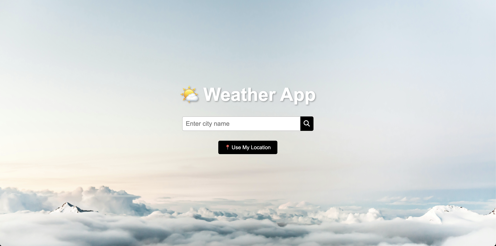

# 🌤️ Advanced Weather App


A modern, responsive weather application built with vanilla JavaScript, featuring real-time weather data, 5-day forecasts, intelligent caching, and Progressive Web App capabilities.

## ✨ Features

### Core Functionality

- **Real-time Weather Data**: Current weather conditions for any city worldwide
- **5-Day Weather Forecast**: Detailed daily predictions with temperature highs/lows
- **Geolocation Support**: Automatic weather detection based on user location
- **Unit Conversion**: Toggle between Celsius/Fahrenheit and metric/imperial units

### Advanced Features

- **Intelligent Caching**: 10-minute cache system to reduce API calls and improve performance
- **Recent Searches**: Local storage of last 5 searched cities for quick access
- **Loading States**: Smooth loading animations and user feedback
- **Error Handling**: Comprehensive network error handling with retry functionality
- **Progressive Web App (PWA)**: Installable app with offline capabilities

### Technical Highlights

- **Responsive Design**: Mobile-first approach with CSS Grid and Flexbox
- **Accessibility**: ARIA labels, keyboard navigation, and screen reader support
- **Modern JavaScript**: ES6+ features, async/await, and modular architecture
- **API Integration**: OpenWeatherMap API with proper error handling
- **Browser Storage**: localStorage for user preferences and search history
- **Service Worker**: Offline functionality and resource caching

## 🚀 Live Demo

[View Live Demo](https://your-weather-app-url.com) (Update with your deployment URL)

## 📱 Screenshots


_Desktop view showing current weather and forecast_


_Mobile responsive design_

## 🛠️ Technologies Used

- **Frontend**: HTML5, CSS3, JavaScript (ES6+)
- **API**: OpenWeatherMap API
- **Storage**: LocalStorage, Cache API
- **PWA**: Service Workers, Web App Manifest
- **Build Tools**: Live Server (for development)
- **Version Control**: Git

## 🎯 Skills Demonstrated

### JavaScript Proficiency

- Asynchronous programming (async/await, Promises)
- DOM manipulation and event handling
- Error handling and user experience
- Module pattern and code organization
- Browser APIs (Geolocation, LocalStorage, Cache API)

### Frontend Development

- Responsive web design principles
- CSS Grid and Flexbox layouts
- Progressive enhancement
- Accessibility best practices (WCAG guidelines)
- Cross-browser compatibility

### API Integration & Performance

- RESTful API consumption
- Data caching strategies
- Network error handling
- Rate limiting awareness
- Performance optimization

### Modern Web Standards

- Progressive Web App implementation
- Service Worker for offline functionality
- Web App Manifest configuration
- Modern JavaScript features

## 🔧 Installation & Setup

1. **Clone the repository**

   ```bash
   git clone https://github.com/JordyMurgueitio/weather-app.git
   cd weather-app
   ```

2. **Install dependencies**

   ```bash
   npm install
   ```

3. **Get API Key**

   - Sign up at [OpenWeatherMap](https://openweathermap.org/api)
   - Get your free API key
   - Replace the API key in `script.js`

4. **Run the application**
   ```bash
   npm start
   ```
   The app will be available at `http://localhost:3000`

## 📋 API Reference

This app uses the OpenWeatherMap API:

- Current Weather Data API
- 5 Day Weather Forecast API
- Geocoding API for location services

## 🏗️ Project Structure

```
weather-app/
├── index.html          # Main HTML file
├── styles.css          # Styling and responsive design
├── script.js           # Main application logic
├── manifest.json       # PWA manifest
├── sw.js              # Service worker for offline functionality
├── package.json       # Dependencies and scripts
├── assets/            # Images and icons
│   ├── weather icons/
│   └── background images/
└── README.md          # Project documentation
```

## 🎨 Design Features

- **Glass-morphism UI**: Modern frosted glass effect
- **Dynamic Backgrounds**: Weather-based background changes
- **Smooth Animations**: CSS transitions and hover effects
- **Mobile-First Design**: Optimized for all screen sizes
- **Custom Weather Icons**: Beautiful custom icon set

## 🔮 Future Enhancements

- [ ] Weather maps integration
- [ ] Push notifications for severe weather
- [ ] Multiple location tracking
- [ ] Weather widgets/embed functionality
- [ ] Historical weather data
- [ ] Dark/Light theme toggle

## 🤝 Contributing

1. Fork the repository
2. Create a feature branch (`git checkout -b feature/amazing-feature`)
3. Commit your changes (`git commit -m 'Add amazing feature'`)
4. Push to the branch (`git push origin feature/amazing-feature`)
5. Open a Pull Request

## 📄 License

This project is licensed under the MIT License - see the [LICENSE](LICENSE) file for details.

## 👨‍💻 Developer

**Jordy Murgueitio**

- Portfolio: [your-portfolio-url.com]
- LinkedIn: [your-linkedin-profile]
- Email: [your-email@example.com]

---

_Built with ❤️ and modern web technologies_
