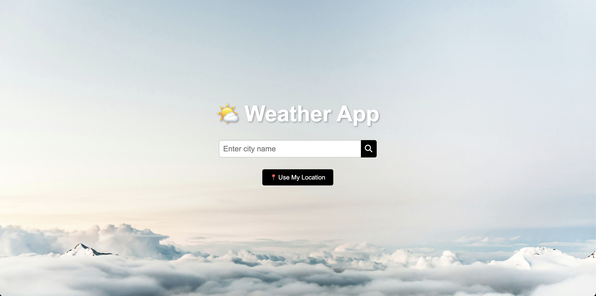

# 🌤️ Weather App

A responsive weather app built with vanilla JavaScript, HTML, and CSS that fetches real-time weather data from the OpenWeatherMap API. Users can search by city name or current location to view current weather conditions, including temperature, humidity, wind speed, and more.

## 🚀 Live Demo

Check out the live version of the app:

## 📸 Screenshots

  
  

## ✨ Features

- 🔍 Seach by City
- 📍 "Use My Location" button (Geolocation API)
- 🌡️ Current Temperature
- 🔁 Toggle between Celsius & Fahrenheit
- 🕓 Displays local time of the searched location
- 📱 Mobile-Responsive Layout
- 🖼️ Dynamic Backgrounds
- 🌤️ Custom Weather Icons

## 🛠️ Built With

- HTML
- CSS
- JavaScript (ES6)
- [OpenWeatherMap API](https://openweathermap.org/)
