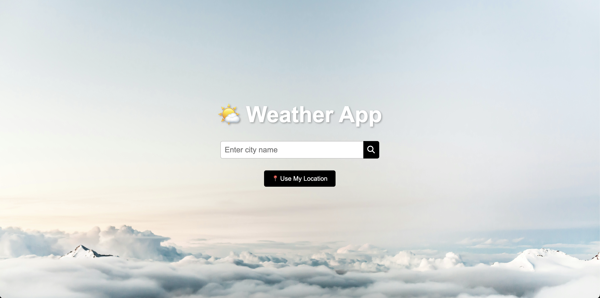

@ -1,180 +0,0 @@
# 🌤️ Advanced Weather App

A modern, responsive weather application built with vanilla JavaScript, featuring real-time weather data, 5-day forecasts, intelligent caching, and Progressive Web App capabilities.

## Features

### Core Functionality

- **Real-time Weather Data**: Current weather conditions for any city worldwide
- **5-Day Weather Forecast**: Detailed daily predictions with temperature highs/lows
- **Geolocation Support**: Automatic weather detection based on user location
- **Unit Conversion**: Toggle between Celsius/Fahrenheit and metric/imperial units

## 🚀 Live Demo

[View Live Demo](https://jordymurgueitio.github.io/weather-app/)

## 📱 Screenshots

_Desktop view showing current weather and forecast_

_Mobile responsive design_

## Technologies Used

- **Frontend**: HTML5, CSS3, JavaScript (ES6+)
- **API**: OpenWeatherMap API
- **Storage**: LocalStorage, Cache API
- **PWA**: Service Workers, Web App Manifest
- **Build Tools**: Live Server (for development)
- **Version Control**: Git

